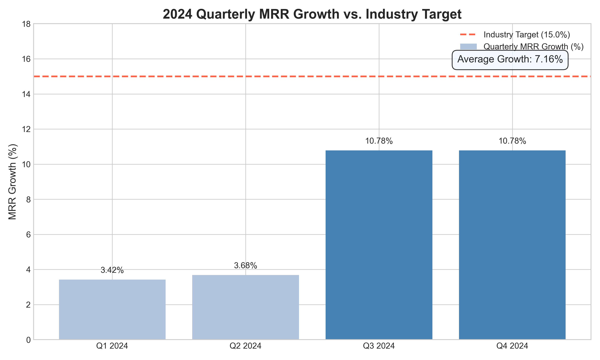

# SaaS Performance Analysis: A Data Story on MRR Growth

This report provides a detailed analysis of our company's Monthly Recurring Revenue (MRR) growth throughout 2024. The findings herein are intended to provide clarity on our current performance and guide strategic decisions to accelerate growth.

**Analyst Contact:** 23f3004197@ds.study.iitm.ac.in

---

## The Challenge: Stagnating Growth in a High-Growth Industry

Our company is facing a critical challenge: our revenue growth is slowing down. While our product is robust, our growth metrics are not keeping pace with the industry.

* **Our Average 2024 MRR Growth:** **7.16%**
* **Industry Benchmark Target:** **15%**

This significant gap of **7.84 percentage points** highlights a performance issue that requires immediate and strategic intervention.

---

## 2024 Performance at a Glance

The quarterly data reveals a story of two halves. After modest growth in the first half of the year, a significant jump occurred in Q3, which then completely flatlined in Q4.

### Key Findings 📊

1.  **A Stagnant Second Half:** The most alarming finding is the **0% growth** between Q3 (10.78%) and Q4 (10.78%). After a promising surge in Q3, momentum completely halted. This suggests we may have hit a saturation point within our current core market.
2.  **Significant Performance Gap:** Our annual average MRR growth of **7.16%** is less than half the industry benchmark of 15%. This indicates that we are not capturing market share as effectively as our competitors.
3.  **Inconsistent Growth:** The jump between Q2 and Q3 suggests our product is capable of high growth, but our strategy has not been able to sustain it.

---

## Business Implications: Why This Matters 📉

This trend is more than just numbers on a chart; it has serious implications for our future.

* **Competitive Disadvantage:** Falling behind the industry benchmark means competitors are growing faster, capturing market share that should be ours, and potentially achieving economies of scale that we cannot.
* **Reduced Company Valuation:** For a SaaS company, growth is a primary driver of valuation. Stagnation can deter investors and negatively impact our financial standing.
* **Risk of Irrelevance:** In the fast-paced SaaS world, a failure to grow is a step toward obsolescence. We risk being out-innovated and overshadowed by more agile competitors.

---

## The Solution: Strategic Expansion into New Markets 🚀

The data strongly suggests that our current market is saturated. To reignite growth and reach our 15% target, we must look beyond our current customer base. The most potent strategy is to **expand into new market segments.**

Here are three actionable recommendations to execute this strategy:

### 1. Identify and Vet Adjacent Market Segments
We must immediately initiate market research to identify untapped or underserved segments. This could involve:
* **Moving Upmarket:** Targeting enterprise-level clients who have larger budgets and require more complex solutions.
* **Exploring New Verticals:** Adapting our product for non-tech industries like Healthcare, Finance, or Logistics, which are currently undergoing rapid digitalization.
* **Geographical Expansion:** Investigating opportunities in emerging international markets where our solution could be a first-mover.

### 2. Tailor Product & Pricing for New Segments
A "one-size-fits-all" approach will fail. We need to adapt our offering to meet the unique needs of a new market segment. This includes:
* **Feature Bundling:** Creating specific feature sets that solve the core problems of the target vertical.
* **Tiered Pricing:** Developing pricing models (e.g., per-user, usage-based) that align with the new segment's buying behavior and budget.

### 3. Launch a Focused Pilot Program
Before committing to a full-scale launch, we should run a lean pilot program in our highest-potential new segment. The goals of this 3-6 month program would be to:
* **Validate Product-Market Fit:** Confirm that our solution genuinely solves a problem for these new users.
* **Gather Feedback:** Collect invaluable insights for product iteration.
* **Build Case Studies:** Create powerful social proof and marketing assets that will be crucial for a wider launch.

By strategically expanding into new markets, we can break through our current growth ceiling and build a more